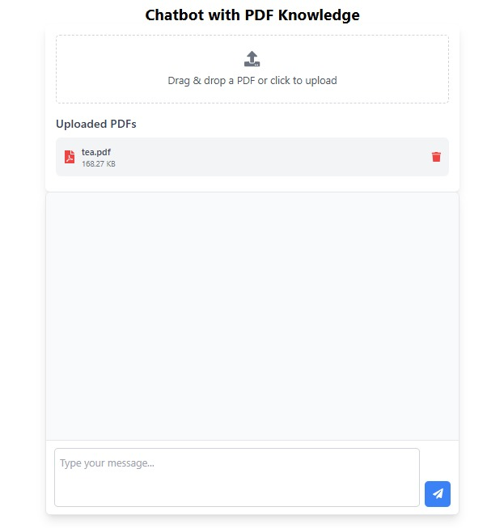
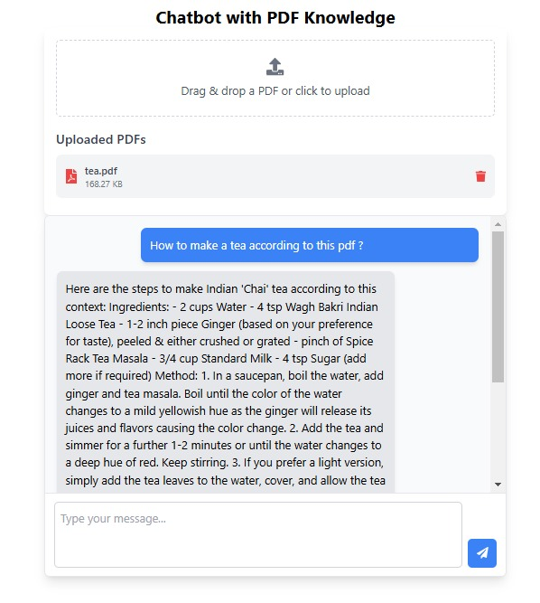

## Welome to my rag project

### To run this : Follow the below steps

```
git clone https://github.com/Anshpreet123/RAG
```
#### get inside the rag folder

#### now get in the backend foler, you'll see example_env.txt file
#### change it's name from example_env.txt --> .env
#### And add your openai_api_key

#### get in the root folder that is rag
#### run this command
```
docker-compose up -d
```

#### wait for building 
#### hit the below url

```
http://localhost:5173/
```

### DEMO 


<p align="center">

  

  

</p>

